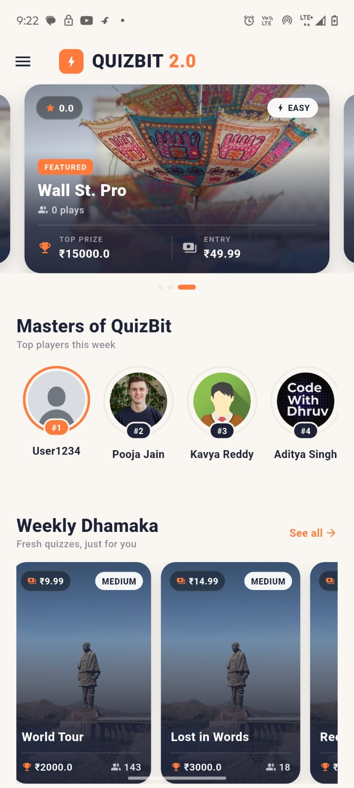
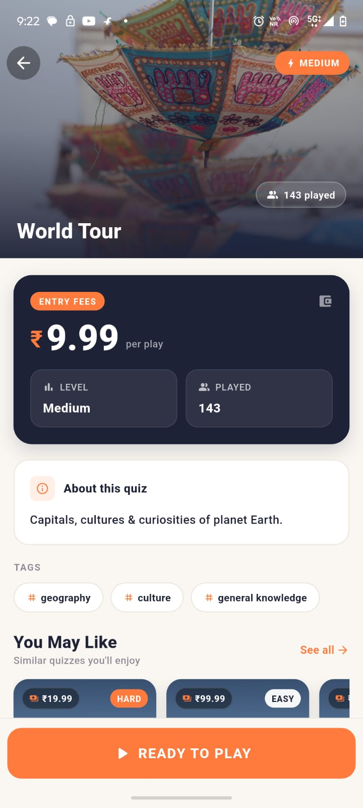
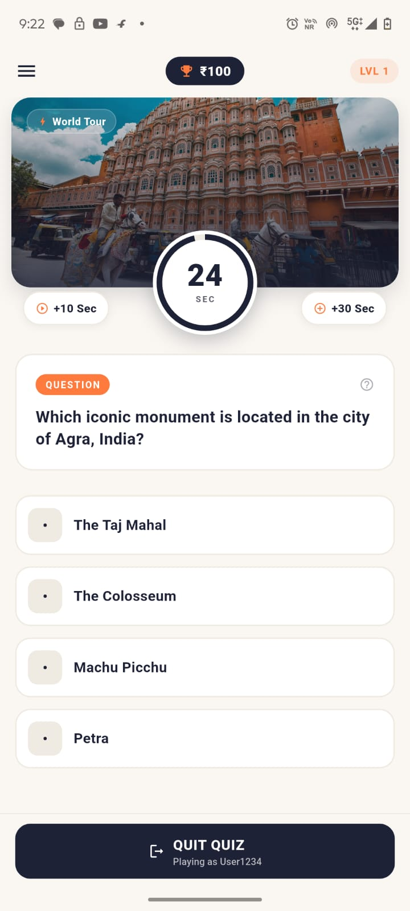
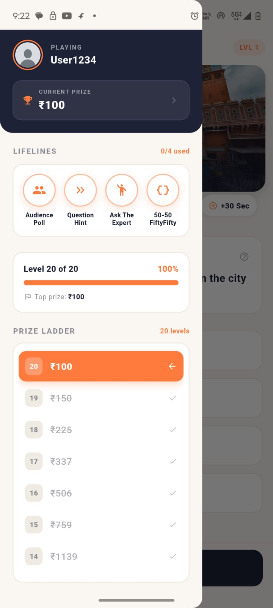
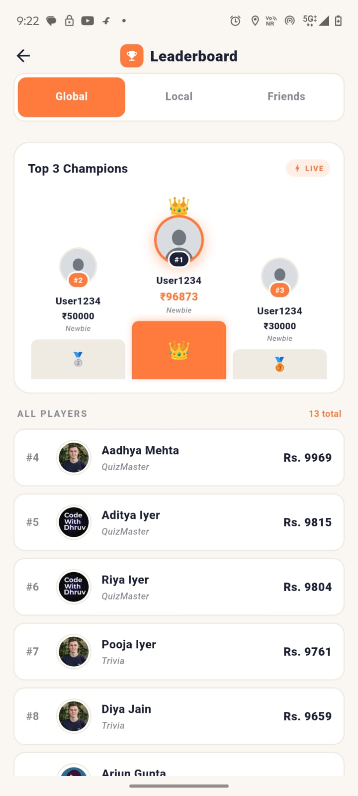
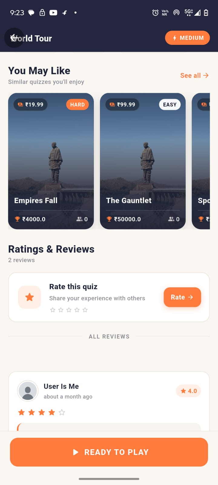
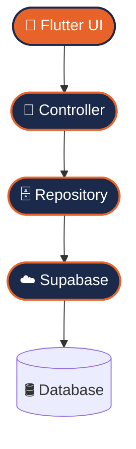
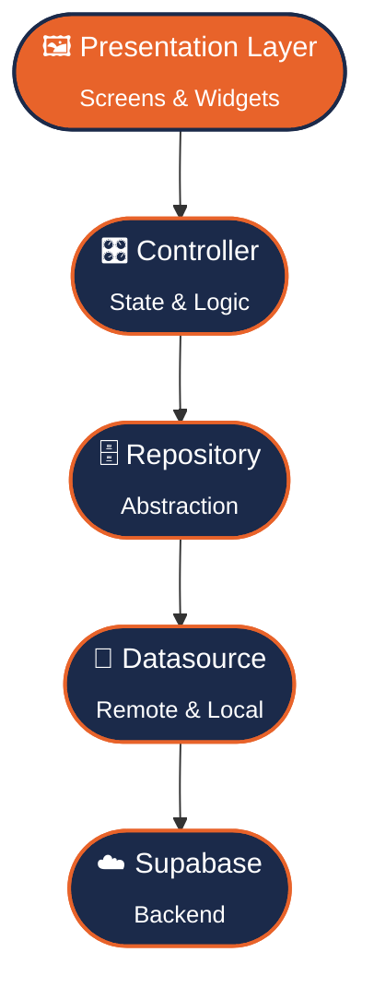

<!-- ============================================================= -->
<!--                        BANNER                                 -->
<!-- ============================================================= -->

<div align="center">

<a href="https://github.com/dhruvarne22/QuizBit_2">
  
</a>

### 🧠 Play. Compete. Win. — A production-grade Flutter quiz experience built live on YouTube.

<br/>

<!-- ACTION BUTTONS -->
<a href="https://github.com/dhruvarne22/QuizBit_2">
  
</a>
&nbsp;
<a href="https://youtu.be/33IWXHx9dus">
  
</a>

<br/><br/>

<!-- TECH BADGES -->


<br/>

<!-- DYNAMIC REPO BADGES -->


</div>

<br/>

<!-- ============================================================= -->
<!--                        HERO                                   -->
<!-- ============================================================= -->

## ✨ Overview

<table>
<tr>
<td width="60%" valign="top">

**QuizBit 2.0** is a modern, premium **Flutter** quiz application engineered to feel like a real product — not a tutorial throwaway. Players browse featured quizzes, pay an entry fee from an in-app wallet, race against a live timer, burn through lifelines, climb a prize ladder, and battle for the top of a global leaderboard.

Under the hood it showcases **production-ready Flutter architecture**: clean layering, the repository pattern, reusable widgets, responsive UI, **Supabase** authentication & database, REST integration, and local state persistence.

This repository accompanies the **Code With Dhruv** YouTube course, where the entire app is built **from scratch**, with every concept explained in detail.

</td>
<td width="40%" valign="top">

> ### 🎯 Why it exists
> To give Flutter learners a **complete, real-world reference** they can read, run, and ship — bridging the gap between "Hello World" and a publishable app.
>
> ### 👥 Who it's for
> - 🟢 Beginners with basic programming knowledge
> - 🔵 Web / backend devs moving into mobile
> - 🟣 Students & freelancers leveling up their portfolio

</td>
</tr>
</table>

> **You will learn:** clean architecture, state management, Supabase auth & CRUD, REST APIs, responsive layouts, custom animations, error handling, and a scalable folder structure — all by building one cohesive product.

<br/>

<!-- ============================================================= -->
<!--                       FEATURES                                -->
<!-- ============================================================= -->

## 🚀 Features

<table>
<tr>
<td width="33%" valign="top">

### 🎨 Experience
- 🧩 **Modern Material UI**
- 📱 **Fully Responsive Design**
- 🌗 **Dark-Ready Design System**
- 🎞️ **Smooth Animations**
- 🧱 **Reusable Custom Widgets**

</td>
<td width="33%" valign="top">

### 🎮 Gameplay
- ⚡ **Quiz Engine**
- ⏱️ **Live Timer + Extensions**
- 🛟 **4 Lifelines** (Poll, Hint, Expert, 50-50)
- 🪜 **Prize Ladder**
- 💸 **Entry Fee + Wallet System**

</td>
<td width="33%" valign="top">

### 🏗️ Engineering
- 🔐 **Authentication**
- ☁️ **Supabase Backend**
- 🌐 **REST API Layer**
- 🧠 **State Persistence**
- 🧼 **Clean Architecture + Repository Pattern**

</td>
</tr>
<tr>
<td valign="top">

### 🏆 Social
- 🥇 **Live Leaderboard** (Global / Local / Friends)
- ⭐ **Ratings**
- 💬 **Reviews**

</td>
<td valign="top">

### 🛡️ Reliability
- 🚦 **Graceful Error Handling**
- 🔁 **Repository Pattern**
- 🧩 **Scalable Structure**

</td>
<td valign="top">

### 🧰 Developer DX
- ♻️ **Composable Components**
- 🗂️ **Config-driven setup**
- 📦 **Production-ready layout**

</td>
</tr>
</table>

<br/>

<!-- ============================================================= -->
<!--                      SCREENSHOTS                              -->
<!-- ============================================================= -->

## 📸 Screenshots

<div align="center">

<table>
  <tr>
    <td align="center" width="33%">
      <br/>
      <sub><b>🏠 Home & Featured Quizzes</b></sub>
    </td>
    <td align="center" width="33%">
      <br/>
      <sub><b>📋 Quiz Details & Entry Fee</b></sub>
    </td>
    <td align="center" width="33%">
      <br/>
      <sub><b>❓ Live Question Screen</b></sub>
    </td>
  </tr>
  <tr>
    <td align="center" width="33%">
      <br/>
      <sub><b>🪜 Lifelines & Prize Ladder</b></sub>
    </td>
    <td align="center" width="33%">
      <br/>
      <sub><b>🏆 Global Leaderboard</b></sub>
    </td>
    <td align="center" width="33%">
      <br/>
      <sub><b>⭐ Ratings & Reviews</b></sub>
    </td>
  </tr>
</table>

</div>

> 💡 Drop your own captures into `assets/screenshots/` to bring this gallery to life.

<br/>

<!-- ============================================================= -->
<!--                      TECH STACK                               -->
<!-- ============================================================= -->

## 🛠️ Tech Stack

| Category | Technology | Purpose |
| :--- | :--- | :--- |
| 🎯 Framework | **Flutter** | Cross-platform UI toolkit |
| 💙 Language | **Dart** | Application logic |
| ☁️ Backend | **Supabase** | Auth, database & realtime |
| 🌐 Networking | **REST API** | Remote data exchange |
| 💾 Local Storage | **Shared Preferences** | State persistence |
| 🔧 Version Control | **Git** | Source management |
| 🐙 Hosting | **GitHub** | Repository & collaboration |
| 🤖 IDE | **Android Studio** | Build & debugging |
| 🧑‍💻 Editor | **VS Code** | Lightweight development |
| 🎨 Design | **Figma** | UI/UX prototyping |

<br/>

### 🔀 Data Flow Diagram



<br/>

<!-- ============================================================= -->
<!--                     ARCHITECTURE                              -->
<!-- ============================================================= -->

## 🏛️ Architecture

QuizBit follows **Clean Architecture** principles — each layer has a single responsibility and depends only on the layer beneath it. This keeps the codebase **testable, scalable, and easy to reason about**.



<div align="center">

| Layer | Responsibility |
| :--- | :--- |
| **Presentation** | Renders UI, reacts to state changes |
| **Controller** | Holds business logic & app state |
| **Repository** | Single source of truth, abstracts data |
| **Datasource** | Talks to Supabase / REST / local cache |
| **Supabase** | Auth, persistence & realtime data |

</div>

<br/>

<!-- ============================================================= -->
<!--                   FOLDER STRUCTURE                            -->
<!-- ============================================================= -->

## 📂 Folder Structure

```bash
lib/
├── 📁 core/              # Constants, theme, base utilities
├── 📁 config/            # Environment & app configuration
├── 📁 data/
│   ├── 📁 datasource/    # Remote (Supabase/REST) & local sources
│   ├── 📁 models/        # Data models & DTOs
│   └── 📁 repositories/  # Repository implementations
├── 📁 presentation/
│   ├── 📁 screens/       # App screens (home, quiz, leaderboard...)
│   ├── 📁 widgets/       # Reusable UI components
│   └── 📁 controllers/   # State management & logic
├── 📁 services/          # Auth, network, storage services
├── 📁 utils/             # Helpers, extensions, formatters
└── 📄 main.dart          # App entry point
```

<br/>

<!-- ============================================================= -->
<!--                     INSTALLATION                              -->
<!-- ============================================================= -->

## ⚙️ Installation

<details open>
<summary><b>📥 Step-by-step setup</b></summary>

<br/>

**1️⃣ Clone the repository**

```bash
git clone https://github.com/dhruvarne22/QuizBit_2.git
cd QuizBit_2
```

**2️⃣ Install dependencies**

```bash
flutter pub get
```

**3️⃣ Configure environment variables**

```bash
cp .env.example .env
# then open .env and add your own keys
```

**4️⃣ Run the app**

```bash
flutter run
```

> ✅ Make sure you have the **Flutter SDK** installed and a device/emulator running.

</details>

<br/>

<!-- ============================================================= -->
<!--                 ENVIRONMENT VARIABLES                         -->
<!-- ============================================================= -->

## 🔑 Environment Variables

Create a `.env` file in the project root using the template below.

```env
# .env.example

SUPABASE_URL=your_supabase_project_url
SUPABASE_ANON_KEY=your_supabase_anon_key
GEMINI_API_KEY=your_gemini_api_key
```

> ⚠️ **Never commit real keys.** Keep `.env` listed in your `.gitignore`.

<br/>

<!-- ============================================================= -->
<!--                  LEARNING OUTCOMES                            -->
<!-- ============================================================= -->

## 🎓 Learning Outcomes

By building QuizBit 2.0 from scratch, you'll walk away knowing how to:

- ✅ Build **responsive UI** that adapts to any screen
- ✅ Master **Flutter navigation** & routing
- ✅ Implement **state management**
- ✅ Apply **Clean Architecture** in a real project
- ✅ Integrate **Supabase** auth & database
- ✅ Handle **authentication** flows
- ✅ Consume **REST APIs**
- ✅ Perform full **CRUD** operations
- ✅ Add robust **error handling**
- ✅ Ship a **deployment-ready** app

<br/>

<!-- ============================================================= -->
<!--                   YOUTUBE COURSE                              -->
<!-- ============================================================= -->

## 📺 Watch the Full Course

<div align="center">

<a href="https://youtu.be/33IWXHx9dus">
  
</a>

<br/><br/>

<a href="https://youtu.be/33IWXHx9dus">
  
</a>

</div>

<br/>

This repo is the companion to the **most comprehensive Flutter course of 2026** by **Code With Dhruv** — a 4-part journey from Dart fundamentals to publishing real apps on the Play Store & App Store. Every line of QuizBit 2.0 is written and explained live.

<div align="center">

<a href="https://youtu.be/33IWXHx9dus">
  
</a>
&nbsp;
<a href="https://github.com/dhruvarne22/QuizBit_2">
  
</a>

</div>

<br/>

<!-- ============================================================= -->
<!--                       ROADMAP                                 -->
<!-- ============================================================= -->

## 🗺️ Roadmap

<details open>
<summary><b>✅ Completed</b></summary>

- [x] Core quiz engine & timer
- [x] Lifelines (Audience Poll, Hint, Expert, 50-50)
- [x] Prize ladder & entry-fee wallet
- [x] Supabase authentication
- [x] Global leaderboard
- [x] Ratings & reviews

</details>

<details open>
<summary><b>🚧 In Progress</b></summary>

- [ ] Friends & local leaderboards
- [ ] Achievements & badges
- [ ] Topic request system

</details>

<details open>
<summary><b>🔮 Upcoming</b></summary>

- [ ] Multiplayer live matches
- [ ] Push notifications
- [ ] Offline quiz mode

</details>

<br/>

<!-- ============================================================= -->
<!--                     PERFORMANCE                               -->
<!-- ============================================================= -->

## 📊 Performance & Specs

| Spec | Value |
| :--- | :--- |
| 📱 **Platform** | Android & iOS |
| 🤖 **Minimum SDK** | Android 21 (5.0) / iOS 12 |
| 🐦 **Flutter Version** | 3.x (stable) |
| 💙 **Dart Version** | 3.x |
| 🏛️ **Architecture** | Clean Architecture + Repository |
| ☁️ **Backend** | Supabase |

<br/>

<!-- ============================================================= -->
<!--                  FUTURE IMPROVEMENTS                          -->
<!-- ============================================================= -->

## 🚧 Future Improvements

1. 🤖 **AI-generated quizzes** powered by Gemini
2. 🎙️ **Voice-based answering** for accessibility
3. 🌍 **Multi-language localization**
4. 🏅 **Seasonal tournaments & events**
5. 💳 **In-app payments** for real wallet top-ups
6. 📈 **Analytics dashboard** for player stats
7. 🔔 **Smart push notifications & reminders**
8. 🧑‍🤝‍🧑 **Real-time multiplayer mode**
9. 🎨 **Theme customization** & profile avatars
10. 📴 **Full offline support** with sync

<br/>

<!-- ============================================================= -->
<!--                    CONTRIBUTING                               -->
<!-- ============================================================= -->

## 🤝 Contributing

Contributions are what make the open-source community amazing! 🌟

<details>
<summary><b>How to contribute</b></summary>

<br/>

1. 🍴 **Fork** the repository
2. 🌿 Create a feature branch
   ```bash
   git checkout -b feature/amazing-feature
   ```
3. 💾 Commit your changes
   ```bash
   git commit -m "✨ Add amazing feature"
   ```
4. 🚀 Push to the branch
   ```bash
   git push origin feature/amazing-feature
   ```
5. 🔁 Open a **Pull Request**

</details>

> 💬 Found a bug or have an idea? Open an [issue](https://github.com/dhruvarne22/QuizBit_2/issues) — feedback is always welcome!

<br/>

<!-- ============================================================= -->
<!--                       SUPPORT                                 -->
<!-- ============================================================= -->

## ❤️ Support the Project

If QuizBit 2.0 helped you learn or build something, here's how you can show love:

<div align="center">

| ⭐ | 🍴 | 📺 | 👍 | 💬 |
| :---: | :---: | :---: | :---: | :---: |
| **Star** the repo | **Fork** it | **Subscribe** on YouTube | **Like** the video | **Leave** feedback |

<br/>

<a href="https://github.com/dhruvarne22/QuizBit_2">
  
</a>

</div>

<br/>

<!-- ============================================================= -->
<!--                    CONNECT WITH ME                            -->
<!-- ============================================================= -->

## 🌐 Connect With Me

<div align="center">

<a href="https://github.com/dhruvarne22">
  
</a>
<a href="https://youtu.be/33IWXHx9dus">
  
</a>
<a href="https://www.instagram.com/dhruvarne/">
  
</a>
<a href="https://discord.gg/Dn8UBu946A">
  
</a>
<a href="https://t.me/cwdflutter">
  
</a>
<a href="https://codewithdhruv22.github.io/DhananjayArne/">
  
</a>

</div>

<br/>

<!-- ============================================================= -->
<!--                       FOOTER                                  -->
<!-- ============================================================= -->

<div align="center">


<sub>⭐ If you made it this far, drop a star — it genuinely helps! ⭐</sub>

</div>